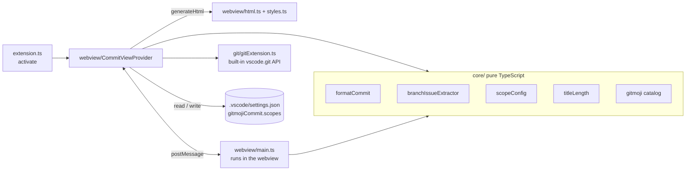

# Commit Wizard

> A VS Code sidebar form that builds [Conventional Commits](https://www.conventionalcommits.org/) with matching [Gitmoji](https://gitmoji.dev/), with a live preview, for developers who want consistent commit messages without memorizing the syntax.

<!-- TODO Vincent : add a 10 s GIF or screenshot of the Commit Builder sidebar (media/ currently only holds the Activity Bar icon). -->
<!-- TODO Vincent : add a Marketplace badge/link only once the extension is published. docs/publishing.md still lists "gaps to close before the first publish" (PNG icon, repository field), so nothing here claims it is live. -->

**Status:** <!-- TODO Vincent : confirm status (active | stable | archived). Latest commits: Sept 2026, version 0.1.0 --> — **License:** MIT

---

## 1. Why this project exists

- **Problem:** a Conventional Commit has interdependent parts (type, scope, issue reference, body, breaking-change footer) plus an optional Gitmoji. Writing them by hand in the Source Control input box is error-prone, and the title length limit is easy to overshoot.
- **Who it's for:** developers and teams who follow Conventional Commits and want shared, project-specific scopes.
- **Intent:** pick the fields in a form, see the exact message live, and inject it into the Git commit box (or commit straight from the sidebar) in one click.

### Features

- Sidebar **Commit Builder** view (Webview View API) with native VS Code styling.
- Fixed `type` list (`feat`, `fix`, `docs`, `style`, `refactor`, `perf`, `test`, `chore`, `build`, `ci`) and the full Gitmoji catalog as its own dropdown.
- Project-specific, team-shareable **scopes** (`gitmojiCommit.scopes` in `.vscode/settings.json`), extendable from the UI.
- **Issue/ticket auto-detection** from the current Git branch name, plus a GitHub/GitLab issue-keyword footer selector (`Closes`, `Fixes`, `Resolves`, `Refs`, `See also`).
- Live **character counter** on the title (soft warning at 50, hard warning at 72 by default, configurable).
- **Live preview** of the formatted message.

Full usage: [`docs/user-guide.md`](docs/user-guide.md).

## 2. Architecture & technical choices

Commit formatting, branch parsing and scope logic live in a `core/` layer with no `vscode` import. The webview and the Git wrapper are the only parts that touch the VS Code API.



| Decision | Why | Alternative considered |
|---|---|---|
| Webview View API in the sidebar ([ADR 0001](docs/adr/0001-architecture-overview.md)) | All fields visible at once, a persistent target for the live preview, native look via VS Code CSS variables | QuickPick/InputBox chain: strictly sequential, no room for a live preview |
| Scopes stored in workspace configuration ([ADR 0002](docs/adr/0002-state-management-and-persistence.md)) | `.vscode/settings.json` is committed, so scopes are shared through git; no custom persistence layer; schema declared in `package.json` | `globalState`/`workspaceState`: invisible to teammates, not stored in the repo. `Global` configuration target would leak scopes into other projects |
| Pure `core/` layer without `vscode` imports (ADR 0001, [technical docs](docs/technical-docs.md)) | Formatting and parsing are unit-testable in plain Node, fast feedback loop | Logic inside the provider: would need the Extension Host to test |
| esbuild with two entry points (`src/extension.ts`, `src/webview/main.ts` in `esbuild.js`) | One build step produces both the extension bundle and the webview script <!-- TODO Vincent : add why esbuild and what alternative you rejected (not documented in the repo) --> | <!-- TODO Vincent : alternative considered --> |

**Stack:** TypeScript, VS Code Extension API (`^1.85.0`), esbuild, Vitest, ESLint, Prettier, `@vscode/vsce`.

**Repository layout:**
```
src/
  core/        # pure logic + *.spec.ts (Vitest)
  git/         # wrapper around the built-in vscode.git extension
  webview/     # CommitViewProvider, html, styles, main.ts (webview script), message types
  test/        # @vscode/test-electron e2e suite
  extension.ts
docs/
  adr/         # architecture decision records
  user-guide.md, technical-docs.md, playbook-runbook.md, installation-local.md, publishing.md
```

**Quality:** 44 unit tests over `src/core/*` (Vitest, no VS Code runtime needed), e2e tests with `@vscode/test-electron` (`npm run test:e2e`, needs a desktop session), ESLint + Prettier. <!-- TODO Vincent : no CI workflow exists in this repo (no .github/). Add one or leave as is. -->

More: [`docs/technical-docs.md`](docs/technical-docs.md), [`docs/playbook-runbook.md`](docs/playbook-runbook.md) (setup, debugging, packaging), [`docs/publishing.md`](docs/publishing.md).

## 3. Quickstart

**Prerequisites:** Node.js 18+ and npm, VS Code 1.85+ (from [`docs/playbook-runbook.md`](docs/playbook-runbook.md) and `engines.vscode`).

```bash
git clone https://github.com/vincent-agi/commit-wizard-vscode.git
cd commit-wizard-vscode
npm install
npm run compile   # type-check + esbuild bundles into dist/
npm test          # Vitest unit tests
```

Then press `F5` in VS Code to launch an Extension Development Host, open a Git repository there, and click the Commit Builder icon in the Activity Bar. To install a local build instead, see [`docs/installation-local.md`](docs/installation-local.md) (`npm run package` builds the `.vsix`).

Optional scopes shared with your team, in `.vscode/settings.json`:

```json
{
  "gitmojiCommit.scopes": [
    { "name": "webview", "description": "Sidebar UI and message passing" }
  ]
}
```

## 4. Lessons learned

<!-- TODO Vincent : these are leads inferred from the code and git history. Rewrite in your own voice or delete. -->

- **What this project validated:** <!-- TODO Vincent : lead — splitting pure `core/` logic from the VS Code API (ADR 0001) made the 44 unit tests run in about 170 ms without the Extension Host. -->
- **What was harder than expected:** <!-- TODO Vincent : lead — the git history shows several fixes around the webview and issue handling: scopes lost when the sidebar was closed and reopened (f9acb3b), webview HTML set before enabling scripts (c4c8035), purely numeric issue IDs needing a `#` prefix (a023488, 8419357). -->
- **What I'd do differently today:** <!-- TODO Vincent : lead — the issue token moved from the commit title to the body, then to a "Refs: #<issue>" line (5644ef1, 5638931, 8486aff): commit format settled after three iterations; the format could have been specified first. Also: no CI yet. -->
- **Next steps / roadmap:** <!-- TODO Vincent : lead — first Marketplace publish (docs/publishing.md lists the remaining gaps: PNG icon, repository field); ADR 0002 mentions commit linting as a future integration of the shared scopes. -->

---

## Contributing

Issues and PRs welcome. Commits follow [Conventional Commits](https://www.conventionalcommits.org/). <!-- TODO Vincent : there is no CONTRIBUTING.md in this repo; add one or keep this line. -->

## About

Built by [Vincent AGI](https://vincent-agi.fr) — software engineer & mentor.
